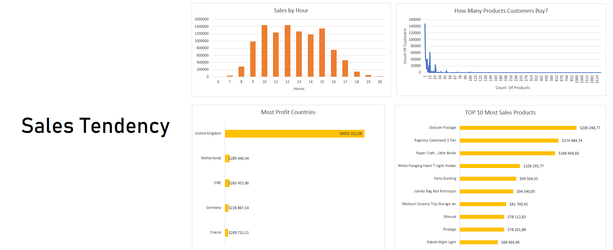
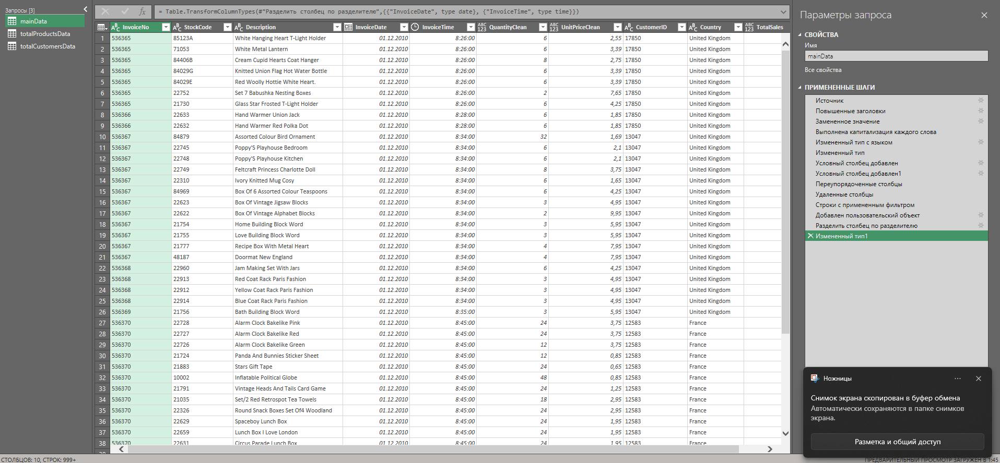
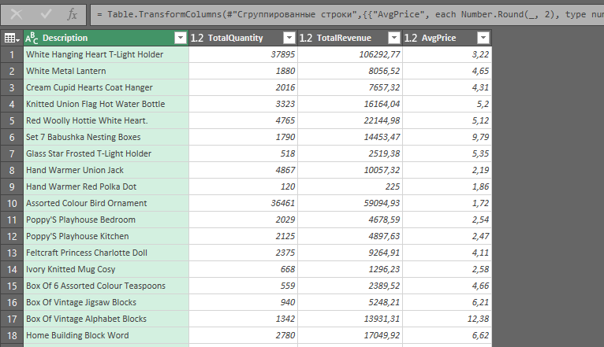
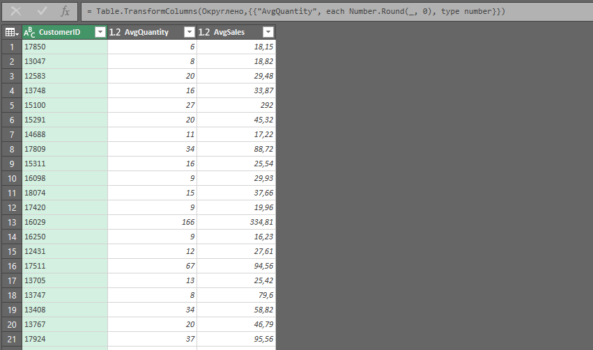
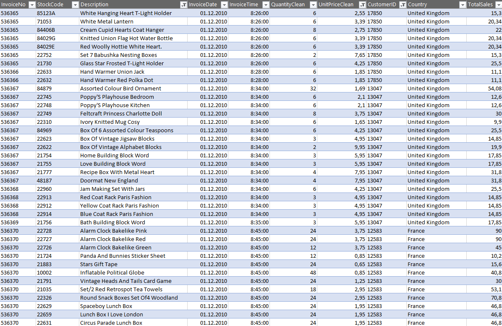

# Финансовый отчет по данным продаж товаров

## О проекте

Проект представляет собой проведение анализа продаж товаров компании и вывод нескольких ценных метрик для бизнеса в виде дашборда.

## Инструменты и технологии
    
Весь проект был выполнен в *Excel* с применением *Power Query* - ETL инструмента для необходимой трансформации исходного датасета ([data.csv](data.csv)).

## Подробный анализ

### *Преобразование исходного датасета*

**С помощью Power Query мы провели несколько трансформаций:**

    1. Установили верный разделитель разрядов для корректной аработы с числами (вместо точки - запятая)
    2. Провели капитализацию названия товара (Описание товара теперь не сплошным капсом)
    3. Установили корректный тип данных для даты, учитывая русский формат отображения дат
    4. Установили все остальные типы данных для столбцов
    5. Избавились от отрицательных значений в числовых данных, путем создания условных столбцов
    6. Удалили столбцы, которые использовали в создании условных столбцов
    7. Добавили столбец продаж товара TotalSales (UnitPrice * Quantity)
    8. Разделили дату и время на два отдельных столбца

**Затем мы посчитали несколько метрик с помощью группировки прямо в редакторе:**

*Для товара - общее количество; прибыль, которую он принес; среднюю цену за единицу товара*

*Для клиента - среднее количество товаров в заказе; средний чек*

### *Построение дашборда*

**Загружаем преобразованный датасет в Excel**

**Строим несколько необходимых сводных таблиц для демонстрации метрик**

## Выводы